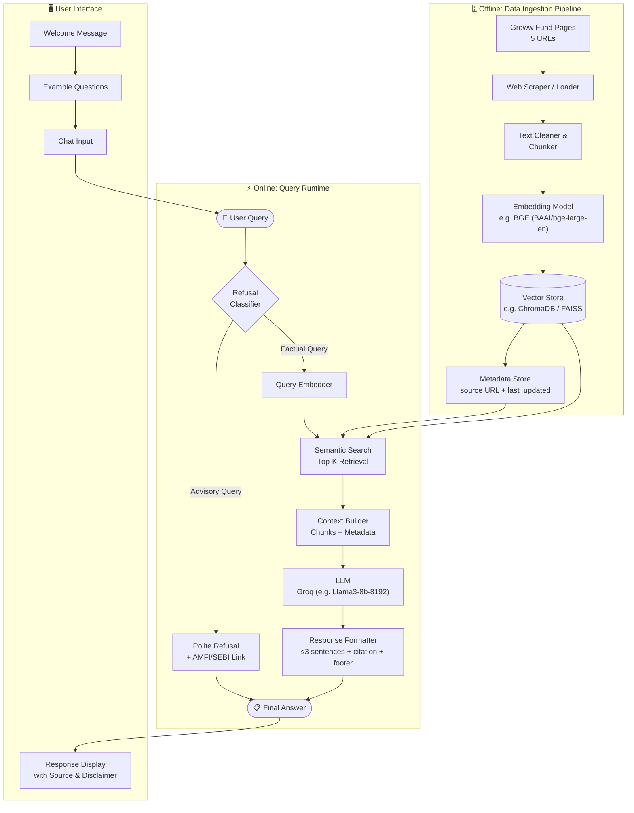
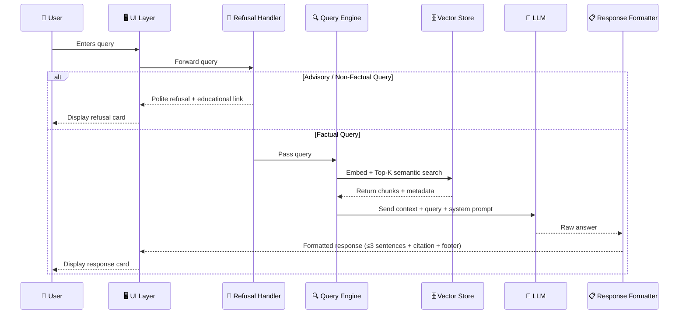

# Architecture: Mutual Fund FAQ Assistant (RAG-Based)

> **Project:** HDFC Mutual Fund FAQ Chatbot — Facts-Only Q&A
> **AMC:** HDFC Mutual Fund | **Schemes:** 5 | **Approach:** Retrieval-Augmented Generation (RAG)

---

## Table of Contents

1. [High-Level Overview](#1-high-level-overview)
2. [System Architecture Diagram](#2-system-architecture-diagram)
3. [Component Breakdown](#3-component-breakdown)
   - [Data Ingestion Pipeline](#31-data-ingestion-pipeline)
   - [Vector Store & Embeddings](#32-vector-store--embeddings)
   - [RAG Query Engine](#33-rag-query-engine)
   - [Response Generator](#34-response-generator)
   - [Refusal Handler](#35-refusal-handler)
   - [User Interface Layer](#36-user-interface-layer)
4. [Data Flow](#4-data-flow)
5. [Directory Structure](#5-directory-structure)
6. [Technology Stack](#6-technology-stack)
7. [Corpus Design](#7-corpus-design)
8. [Prompt Engineering Strategy](#8-prompt-engineering-strategy)
9. [Constraints & Compliance Layer](#9-constraints--compliance-layer)
10. [Known Limitations](#10-known-limitations)

---

## 1. High-Level Overview

The system is a **Retrieval-Augmented Generation (RAG)** pipeline that answers factual mutual fund queries by:

1. **Ingesting** official public documents (Groww fund pages) into a vector store
2. **Retrieving** the most relevant text chunks for a given user query using semantic search
3. **Generating** a concise, factual, source-cited response using an LLM, constrained by a strict system prompt
4. **Refusing** any advisory, comparative, or opinion-based queries before they reach the LLM

The system operates entirely on **pre-ingested, verified content** — it does not make live web requests at query time.

---

## 2. System Architecture Diagram



---

## 3. Component Breakdown

### 3.1 Data Ingestion Pipeline

**Purpose:** Converts raw web pages into searchable vector embeddings stored offline.

#### Sources

| Source Type | Origin | Format | Per-Scheme? |
|---|---|---|---|
| Groww Fund Pages | groww.in | HTML | ✅ Yes (5 URLs) |

#### Steps

```
Load Raw Source
      ↓
Parse & Extract Text
      ↓
Clean (strip boilerplate, ads, nav menus)
      ↓
Chunk (fixed-size with overlap, ~512 tokens, 50-token overlap)
      ↓
Attach Metadata { source_url, fund_name, category, doc_type, last_updated }
      ↓
Embed (via Embedding Model)
      ↓
Upsert into Vector Store
```

> [!NOTE]
> All ingestion is **offline and batch-run**. The `last_updated` date stored in metadata is what appears in the response footer: `"Last updated from sources: <date>"`.

---

### 3.2 Vector Store & Embeddings

**Purpose:** Stores embedded document chunks and supports fast semantic similarity search.

| Parameter | Choice | Rationale |
|---|---|---|
| Embedding Model | BGE model (e.g., `BAAI/bge-large-en-v1.5`) | High quality, cost-effective |
| Vector DB | ChromaDB (local) or FAISS | Lightweight, no external server needed |
| Chunk Size | ~512 tokens | Balances context richness vs. retrieval precision |
| Chunk Overlap | 50 tokens | Preserves sentence continuity across chunks |
| Top-K Retrieval | 3–5 chunks | Enough context for a 3-sentence answer |
| Similarity Metric | Cosine similarity | Standard for text embeddings |

**Metadata stored per chunk:**

```json
{
  "source_url": "https://groww.in/mutual-funds/hdfc-large-cap-fund-direct-growth",
  "fund_name": "HDFC Large Cap Fund – Direct Growth",
  "category": "Equity – Large Cap",
  "doc_type": "Groww Fund Page",
  "last_updated": "2026-07-26"
}
```

---

### 3.3 RAG Query Engine

**Purpose:** Converts a user query into a vector, retrieves the most relevant document chunks, and assembles a context payload for the LLM.

#### Query Flow

```
User Query (raw text)
      ↓
Embed query using same embedding model
      ↓
Run Top-K similarity search against vector store
      ↓
Retrieve K chunks + their metadata
      ↓
Deduplicate by source_url
      ↓
Assemble context string: [chunk_1]\n[chunk_2]...[chunk_K]
      ↓
Select primary citation: source_url of highest-scoring chunk
      ↓
Pass { context, query, citation, last_updated } to LLM
```

---

### 3.4 Response Generator

**Purpose:** Takes the retrieved context and generates a factual, constrained answer using an LLM.

#### System Prompt (Core)

```
You are a facts-only mutual fund FAQ assistant for HDFC Mutual Fund schemes.

Rules:
- Answer ONLY using the provided context. Do not use prior knowledge.
- Limit your response to a maximum of 3 sentences.
- Always end your response with exactly one citation link from the provided source.
- Append the footer: "Last updated from sources: <last_updated_date>"
- Never provide investment advice, recommendations, or performance comparisons.
- If the context does not contain the answer, say:
  "I could not find this information in the available sources."
- Use plain, simple language suitable for retail investors.
```

#### Response Format

```
<Factual answer in ≤ 3 sentences.>

📎 Source: <citation_url>
🕒 Last updated from sources: <date>
```

---

### 3.5 Refusal Handler

**Purpose:** Acts as a pre-LLM gate. Detects and rejects advisory, comparative, or speculative queries before they reach the retrieval or generation steps.

#### Detection Strategy

Uses a **keyword + intent classifier** approach:

| Signal Type | Examples | Action |
|---|---|---|
| Advisory keywords | "should I", "is it worth", "recommend", "best fund" | Refuse |
| Comparative intent | "which is better", "compare", "vs", "outperform" | Refuse |
| Return prediction | "will it grow", "future returns", "expected NAV" | Refuse |
| Personal finance | "how much should I invest", "is it safe for me" | Refuse |
| Factual query | "what is the expense ratio", "exit load of HDFC Large Cap" | ✅ Pass through |

#### Refusal Response Template

```
I'm designed to answer factual questions about HDFC Mutual Fund schemes only.

Questions about investment recommendations or performance comparisons
fall outside my scope.

For guidance, you may visit:
📘 AMFI Investor Education: https://www.amfiindia.com/investor-corner
📘 SEBI Investor Education: https://investor.sebi.gov.in

⚠️ Facts-only. No investment advice.
```

---

### 3.6 User Interface Layer

**Purpose:** Minimal, clean chat interface for retail investors and support teams.

#### Required UI Elements

| Element | Description |
|---|---|
| Welcome Banner | Introduces the assistant and its scope |
| Example Questions | 3 pre-filled clickable sample queries |
| Disclaimer Strip | Persistent banner: `"Facts-only. No investment advice."` |
| Chat Input | Text input + Submit button |
| Response Card | Answer text + citation link + last updated footer |
| Refusal Card | Polite refusal message + educational links |

#### Example Sample Questions (displayed on load)

1. *"What is the expense ratio of HDFC Large Cap Fund?"*
2. *"What is the exit load for HDFC Small Cap Fund – Direct Growth?"*
3. *"How do I download my capital gains report for HDFC funds?"*

---

### 3.7 Scheduler Component

**Purpose:** Automates the Data Ingestion Pipeline to run daily, ensuring the vector store contains the latest data (e.g., NAV, Expense Ratio).

#### Implementation Strategy
- A dedicated background process (using Python's `schedule` library or OS cron jobs) that triggers the ingestion pipeline automatically once a day.
- Operates entirely independent of the Streamlit user interface, keeping data fresh without manual intervention.

---

## 4. Data Flow



---

## 5. Directory Structure

```
Groww-Mutual Fund/
│
├── Docs/
│   ├── ProblemStatement.md        # Project requirements
│   └── Architecture.md            # This document
│
├── data/
│   ├── raw/                       # Downloaded HTML pages
│   │   └── groww/                 # Scraped Groww fund pages
│   └── processed/                 # Cleaned text chunks (JSON/JSONL)
│
├── embeddings/
│   └── chroma_db/                 # ChromaDB persistent vector store
│
├── src/
│   ├── ingestion/
│   │   ├── scraper.py             # Web scraper for HTML sources
│   │   ├── chunker.py             # Text splitting & chunking
│   │   ├── embedder.py            # Embedding + upsert to vector store
│   │   ├── pipeline.py            # End-to-end pipeline execution
│   │   └── scheduler.py           # Automated daily scheduler
│   │
│   ├── retrieval/
│   │   ├── query_engine.py        # Semantic search + context builder
│   │   └── refusal_handler.py     # Intent classifier + refusal logic
│   │
│   ├── generation/
│   │   ├── llm_client.py          # LLM API wrapper
│   │   ├── prompt_builder.py      # System + user prompt assembly
│   │   └── response_formatter.py  # Citation + footer attachment
│   │
│   └── ui/
│       ├── app.py                 # Main Streamlit / FastAPI app
│       └── components.py          # UI components (chat, disclaimer)
│
├── config/
│   └── settings.py                # API keys, model names, chunk config
│
├── requirements.txt
└── README.md
```

---

## 6. Technology Stack

| Layer | Technology | Purpose |
|---|---|---|
| **Language** | Python 3.10+ | Core implementation |
| **Web Scraping** | `requests` + `BeautifulSoup4` | Scrape Groww pages |
| **Text Chunking** | `LangChain` `RecursiveCharacterTextSplitter` | Split documents into overlapping chunks |
| **Embedding Model** | BGE model (e.g., `BAAI/bge-large-en-v1.5`) | Convert text chunks & queries to vectors |
| **Vector Store** | `ChromaDB` (local persistent) | Store & query embedded chunks |
| **LLM** | Groq (e.g. Llama3-8b-8192) | Generate constrained factual answers |
| **Orchestration** | `LangChain` or custom pipeline | Tie ingestion, retrieval, generation |
| **UI Framework** | `Streamlit` | Minimal, rapid chat interface |
| **Config Management** | `python-dotenv` | Manage API keys securely |

> [!TIP]
> For a fully local (offline) setup, you can replace the BGE model or Groq LLM with local equivalents running on `Ollama`.

---

## 7. Corpus Design

### Fund Scheme → Source Mapping

| Fund | Groww Page |
|---|---|
| HDFC Gold ETF FoF | ✅ |
| HDFC Large Cap Fund | ✅ |
| HDFC Small Cap Fund | ✅ |
| HDFC Silver ETF FoF | ✅ |
| HDFC Mid Cap Fund | ✅ |

### Estimated Corpus Size

| Document Type | Count | Est. Chunks |
|---|---|---|
| Groww Fund Pages | 5 | ~50 |
| **Total** | **5 docs** | **~50 chunks** |

---

## 8. Prompt Engineering Strategy

### System Prompt Design Principles

| Principle | Implementation |
|---|---|
| **Grounding** | "Answer ONLY using the provided context" |
| **Length control** | "Maximum 3 sentences" |
| **Citation mandate** | "Always include exactly one source URL" |
| **Footer mandate** | "Append: Last updated from sources: \<date\>" |
| **No hallucination** | "If not in context, say you couldn't find it" |
| **No advice** | "Never recommend, compare, or predict returns" |
| **Tone** | "Plain, simple language for retail investors" |

### Context Window Management

```
System Prompt     ~300 tokens
Retrieved Context ~800 tokens  (Top 3–5 chunks × ~200 tokens each)
User Query        ~50 tokens
───────────────────────────────
Total Input       ~1,150 tokens   ← well within Groq Llama3's limit
Max Output        ~150 tokens     (3 sentences + citation + footer)
```

---

## 9. Constraints & Compliance Layer

### What the System Will NOT Do

| Category | Prohibited Action |
|---|---|
| Investment Advice | Recommend funds, asset allocation, timing |
| Performance Comparison | Compare returns, NAV trends, rankings |
| PII Handling | Collect/store PAN, Aadhaar, OTP, email, phone |
| Third-Party Sources | Use blogs, Reddit, news articles |
| Speculation | Predict future NAV, AUM growth |

### Enforcement Mechanisms

```
┌─────────────────────────────────────┐
│         Compliance Layer            │
│                                     │
│  1. Refusal Handler (pre-LLM gate)  │  ← Blocks advisory queries
│  2. System Prompt constraints       │  ← LLM-level guardrails
│  3. Source whitelist (ingestion)    │  ← Only official URLs ingested
│  4. No PII in data pipeline         │  ← Privacy by design
│  5. Persistent disclaimer in UI     │  ← User-facing transparency
└─────────────────────────────────────┘
```

---

## 10. Known Limitations

| Limitation | Description | Mitigation |
|---|---|---|
| **Stale data** | Corpus reflects ingestion date, not live NAV or AUM | Re-run ingestion pipeline monthly; show `last_updated` date clearly |
| **No live NAV** | Cannot return today's NAV or real-time prices | Redirect user to Groww or AMC website for live data |
| **Embedding drift** | Retrieval quality depends on embedding model consistency | Use same model for ingestion and query; do not swap models without re-embedding |
| **Refusal false positives** | Overly strict classifier may refuse valid factual questions | Tune keyword list; add query rephrasing fallback |
| **5-scheme scope** | Only covers the 5 selected HDFC schemes | Clearly state scope in welcome message and disclaimer |
| **No multi-turn memory** | Stateless Q&A; no conversation history | Each query is independent; suitable for FAQ use case |
| **Groq API Rate Limits** | Free tier `llama-3.3-70b-versatile` has strict limits (30 RPM, 1K RPD, 12K TPM, 100K TPD) | Implement exponential backoff and gracefully handle errors |

---

> [!IMPORTANT]
> This architecture is designed to be **modular and extensible**. Each component (scraper, embedder, retriever, LLM client) can be swapped independently without affecting other layers.

---

*Architecture Document — HDFC Mutual Fund FAQ Assistant | Last revised: 2026-07-26*
